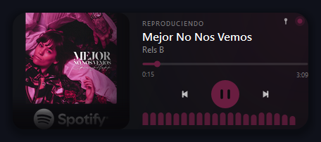
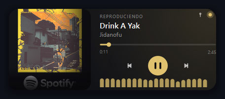
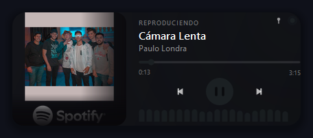
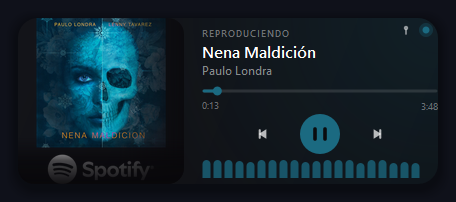

# Nexus Mini Player

Widget flotante para Windows que muestra lo que está sonando ahora mismo: carátula, título, artista, barra de progreso y controles básicos. No está atado a una sola app — lee cualquier reproductor que registre su sesión con Windows: **Spotify**, **YouTube Music**, **Apple Music**, el navegador, VLC, etc.

## Capturas

| | |
|---|---|
|  |  |
|  |  |

El color de acento (barra de progreso, botón de play, ecualizador) se calcula automáticamente a partir de la carátula de cada canción — no es un tema fijo, cambia solo.

## Características

| Visual | Funcionalidad |
|--------|---------------|
| Carátula del álbum en tiempo real, con esquinas redondeadas | Play / pause / anterior / siguiente |
| Color de acento dinámico según la carátula | Seek clickeable en la barra de progreso |
| Ecualizador decorativo animado | Control de volumen (scroll sobre el ícono, cuando hay audio local que ajustar) |
| Punto de estado (reproduciendo / pausado / desconectado) | Atajo `Ctrl + Shift + M` para mostrar/ocultar (global) |
| Indicador de "siempre encima" activo | Ícono en la bandeja del sistema para mostrar/ocultar y cerrar |
| Botón de cerrar visible al pasar el mouse | Menú contextual con clic derecho |
| Widget compacto, arrastrable | Recuerda la última posición, y vuelve a una posición segura si el monitor guardado ya no está conectado |
| | Detecta automáticamente qué app está sonando (Spotify, YouTube Music, Apple Music, navegador...) |

## Instalación

```bash
python -m venv venv
venv\Scripts\activate
pip install -r requirements.txt
python app.pyw
```

También podés abrir `app.pyw` con doble clic después de instalar las dependencias.

### Ejecutable standalone (.exe)

Si no querés instalar Python ni dependencias, podés compilar un `.exe` con [PyInstaller](https://pyinstaller.org):

```bash
pip install pyinstaller
pyinstaller nexus.spec --noconfirm
```

El ejecutable queda en `dist\NexusMiniPlayer.exe` — doble clic y listo, sin instalar nada más.

## Controles

| Acción | Resultado |
|--------|-----------|
| Clic izquierdo + arrastrar | Mover el widget |
| Doble clic en carátula | Reproducir o pausar |
| `Play` / `Pause` | Reproducir o pausar |
| `<<` / `>>` | Canción anterior o siguiente |
| Clic en barra de progreso | Adelantar o retroceder |
| Scroll sobre el ícono de volumen | Subir o bajar el volumen (solo si la app suena en esta PC) |
| `Ctrl + Shift + M` | Mostrar u ocultar (funciona aunque el widget no tenga foco) |
| Clic derecho | Abrir menú contextual (siempre encima, cerrar) |
| Clic en el ícono de la bandeja del sistema | Mostrar u ocultar el widget |
| Clic derecho en el ícono de la bandeja | Menú (mostrar/ocultar, cerrar) |

## Estructura del proyecto

```
nexus-mini-player/
├── src/
│   ├── main.py       Punto de entrada + hotkey global
│   ├── window.py     Ventana flotante principal, layout y pintado
│   ├── widgets.py     Carátula, barra de progreso, ecualizador, botones
│   ├── spotify.py     Lectura y control de la sesión multimedia activa vía winsdk
│   ├── volume.py      Control de volumen del proceso activo vía pycaw
│   ├── theme.py       Dimensiones y constantes visuales
│   └── config.py      Carga/guarda posición en %LOCALAPPDATA%\NexusMiniPlayer
├── assets/
│   └── icon.ico        Ícono de la app
├── screenshots/         Capturas para este README
├── app.pyw              Acceso directo (doble clic)
├── requirements.txt      Dependencias
└── nexus.spec            Config de PyInstaller para empaquetar como .exe
```

## ¿Por qué no se ve el volumen a veces?

Si la música suena en otro dispositivo (por ejemplo, Spotify Connect reproduciendo desde el celular mientras la app de escritorio solo la controla), no hay audio pasando por esta PC — por lo tanto no hay nada que el mezclador de Windows pueda ajustar, y el ícono de volumen se oculta automáticamente. Vuelve a aparecer en cuanto la reproducción es local.

## Troubleshooting

**No aparece nada reproduciéndose**

- Abrí Spotify, YouTube Music o Apple Music y reproducí algo.
- Si sigue igual, reiniciá la app de música y volvé a abrir el widget.
- Revisá `%LOCALAPPDATA%\NexusMiniPlayer\nexus.log` para ver el último error.

**Error con dependencias**

```bash
pip install -r requirements.txt
```

**La carátula no aparece**

- Algunas sesiones multimedia de Windows tardan en entregar la carátula.
- Cambiá de canción o reiniciá la app de música.

**Algunas carátulas traen un logo o marca de agua**

Eso viene incrustado en la imagen oficial que la propia fuente (Spotify, etc.) entrega para esa canción — el widget no lo agrega. Se atenúa automáticamente con un degradado, pero no siempre desaparece del todo.
